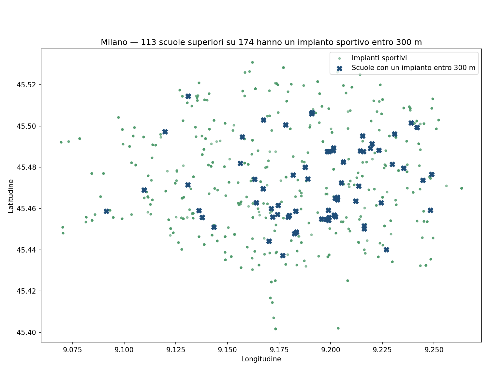

# Scuole e impianti sportivi a Milano

[](https://github.com/AlbertoMariaPareti/scuole-sport-milano/actions/workflows/ci.yml)
[](https://albertomariapareti.github.io/scuole-sport-milano/)
[](https://www.python.org/)
[](LICENSE)

**Quante scuole superiori di Milano hanno un impianto sportivo a distanza di camminata?**

Incrociando i dati aperti del Comune: **113 su 174, il 65%, hanno almeno un impianto sportivo entro 300 metri.**

### 👉 [Apri la mappa interattiva](https://albertomariapareti.github.io/scuole-sport-milano/)

Clicca su una scuola per vedere nome, indirizzo e quale impianto ha più vicino, con la distanza. Gli impianti sono raggruppati e si aprono avvicinando lo zoom; i due livelli si accendono e spengono dal controllo in alto a destra.



---

## Come funziona

Il punto delicato è la **proiezione**. I due geojson arrivano in EPSG:4326, dove le coordinate sono gradi: un "raggio di 300" calcolato lì non sarebbe 300 metri, e a Milano un grado di longitudine vale circa 78 km mentre uno di latitudine ne vale 111. Prima di qualsiasi misura i dati vengono quindi riproiettati in **EPSG:32632** (UTM 32N, il fuso che copre Milano), dove l'unità è il metro.

Il secondo punto è **come si fa l'incrocio**. La strada intuitiva — un buffer attorno agli impianti, poi `sjoin` o `overlay` con le scuole — restituisce una riga per ogni coppia (scuola, impianto). A 200 metri sono 224 righe per 66 scuole: una scuola circondata da tredici impianti verrebbe disegnata tredici volte nello stesso punto, e ogni conteggio risulterebbe gonfiato di oltre tre volte. Qui si usa `sjoin_nearest` con `max_distance`, che risponde alla domanda giusta — *esiste un impianto entro X metri?* — e in più restituisce la distanza dal più vicino, che è il dato mostrato nel tooltip.

## Uso

```bash
git clone https://github.com/AlbertoMariaPareti/scuole-sport-milano.git
cd scuole-sport-milano
pip install -r requirements.txt

python genera_mappa.py
```

Produce `docs/index.html` (la mappa interattiva) e `images/anteprima_300m.png`. I geojson vengono scaricati al primo avvio dentro `data/` — circa 600 KB — e riutilizzati dopo.

| Opzione | Effetto |
|---|---|
| `--raggio 500` | cambia il raggio di ricerca in metri (default: 300) |
| `--csv scuole.csv` | esporta l'elenco: scuola, indirizzo, quartiere, impianto più vicino, distanza |
| `--output mappa.html` | percorso della mappa interattiva |
| `--anteprima img.png` | percorso dell'anteprima statica |
| `--aggiorna-dati` | riscarica i geojson ignorando la copia locale |

Esempio di CSV:

```csv
DENOMINAZ,INDIRIZZO,NIL,impianto,impianto_indirizzo,distanza_m
ITI DON BOSCO,VIA TONALE 19,STAZIONE CENTRALE - PONTE SEVESO,ISTITUTO SALESIANO DON BOSCO,VIA TONALE 19,0.0
```

### Versione server

```bash
python app.py
# http://127.0.0.1:5000/?raggio=500
```

La mappa in `docs/` risponde a una domanda sola, quella con il raggio a 300 metri. `app.py` mette il raggio come parametro nell'URL, così si può cambiare e rivedere il risultato senza rigenerare niente — è l'unico caso in cui un server qui serve davvero. La logica è la stessa: entrambi gli entry point chiamano `analisi.py`.

## Come cambia il risultato al variare del raggio

| Raggio | Scuole coperte |
|---|---|
| 200 m | 66 su 174 (38%) |
| 300 m | 113 su 174 (65%) |
| 500 m | 166 su 174 (95%) |
| 1000 m | 174 su 174 (100%) |

A 1 km la domanda smette di discriminare: a Milano praticamente ogni scuola ha qualcosa nel raggio. È a 200–300 metri, la distanza che si copre a piedi fra una lezione e l'altra, che la differenza fra quartieri diventa visibile.

## File

| File | Contenuto |
|---|---|
| `analisi.py` | dati e logica: download in cache, riproiezione, join spaziale, costruzione della mappa |
| `genera_mappa.py` | entry point da riga di comando → `docs/index.html`, anteprima PNG, CSV |
| `app.py` | entry point Flask, con il raggio come parametro nell'URL |
| `docs/index.html` | mappa generata, committata perché è quella che GitHub Pages pubblica |
| `data/` | geojson scaricati a runtime, non versionati |
| `esercizi/mappa_mondo.py` | esercizio introduttivo: confini nazionali letti direttamente da un GeoJSON remoto |

La logica sta in `analisi.py` e non dentro la route di Flask: se ci stesse, la versione da riga di comando dovrebbe riscriverla, e prima o poi le due risponderebbero in modo diverso alla stessa domanda.

## Pubblicare la mappa

**Settings → Pages → Source: Deploy from a branch → `main` / `/docs`.** Da lì in poi ogni push che aggiorna `docs/index.html` aggiorna anche la mappa pubblica.

## Fonti

- [Scuole secondarie di secondo grado](https://dati.comune.milano.it/dataset/ds78-infogeo-scuole-secondarie-secondo-grado) — Comune di Milano, licenza CC BY 4.0
- [Impianti sportivi](https://dati.comune.milano.it/dataset/ds34-infogeo-impianti-sportivi) — Comune di Milano, licenza CC BY 4.0

## Limiti noti

I dati sono georiferiti al civico della sede, quindi la distanza è in linea d'aria: non tiene conto del percorso reale a piedi né delle strade da attraversare. Un impianto "a 100 metri" oltre una circonvallazione è più lontano di quanto sembri. Gli impianti includono strutture private e a uso riservato, che non sono necessariamente accessibili alle scuole vicine.

## Licenza

[MIT](LICENSE) per il codice. I dati restano del Comune di Milano sotto licenza CC BY 4.0.
